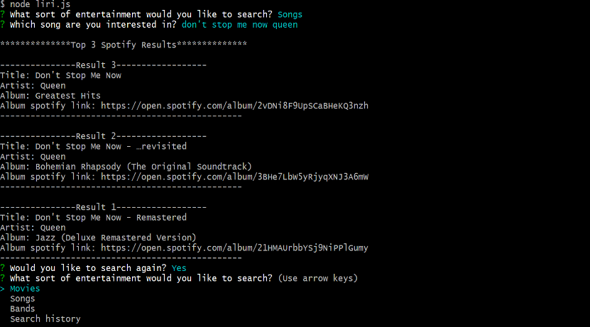

# liri-node-app
Command line node app that takes in parameters and gives back movie, song, and concert data.

# tech
Node, Spotify API, Axios, Moment

# goals
Built to integrate asynchronous API calls fron the back end, this command line Node app allows the user to search for info on movies, songs, and upcoming concerts. Searches are saved in a .txt file and can be recalled. Demo video link provided.

# try it yourself!
To run it yourself, download the GitHub repo and run npm install in the terminal. To see a video of it in action, check out https://drive.google.com/file/d/1SV45M03akrh0nR7AlrjP2PxALx-rMbqO/view. 

